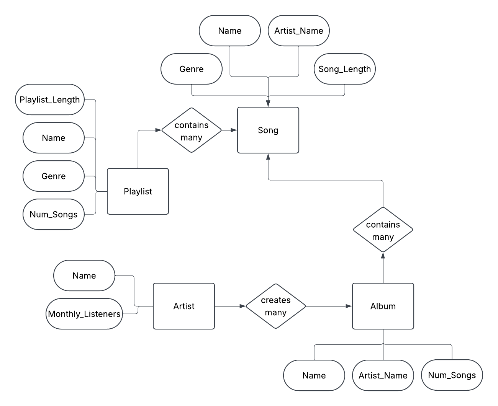

# McGohan Conceptual Model

* What's the purpose of a conceptual model?
    * Conceptual models help define the schema for a database in the simplest of terms. This helps future development easier by preventing confusion, grow with business needs, and a clear vision of entity relationships
* What's an Entity?
    * An entity is a real-world object that have specific details, called attributes, that define what each entity is
* What's an Attribute?
    * Attributes are details or identifiers for entities using various datatypes. Attributes can be a primary key, `name`, `date_created`, and so on.
* What's a Relationship?
    * A relationship is the connection between two entities and how they relate to each other. For example, a *person* can have many *cars*, but a *car* generally has one *person* who *owns* it.

## Conceptual Model for Music App

The conceptual model displays 4 entities: `Artist`, `Album`, `Song`, `Playlist`.

`Artist` contains two attributes: `Name` and `Monthly_Listeners`.
* `Monthly_Listeners` is used to determine the popularity of an artist the user would like to listen to.
* No other attributes besides a primary key is needed for artist, as their songs will contain a genre, and users will discover songs based on genres.

`Album` contain three attributes: `Name`, `Artist_Name`, and `Num_Songs`.
* `Artist_Name` is to tie the creator of the album to its respective owner.
* `Num_Songs` allows the user to view how many songs are contained within the chosen album.
* A `genre` attribute is not necessary here as albums can contain multiple songs with varying genres.

`Song` contains 4 attributes: `Name`, `Artist_Name`, `Genre`, and `Song_Length`
* `Genre` helps users discover songs based on a chosen genre.
* `Song_Length` allows users to view how long a song is, since most listeners judge songs based on length.*

`Playlist` contains 4 attributes: `Playlist_Length`, `Name`, `Genre`, and `Num_Songs`
* `Playlist_Length` allows users to view how long in hours/minutes a playlist is.

`Artists` can create many `albums`.
`Albums` can contain many `songs`.
`Playlists` can contain many `songs`.