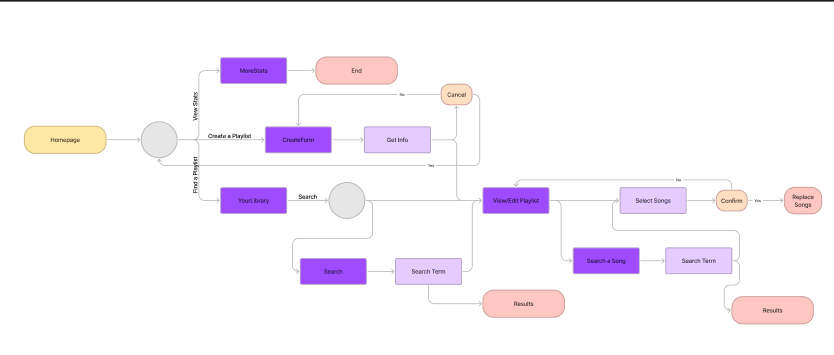
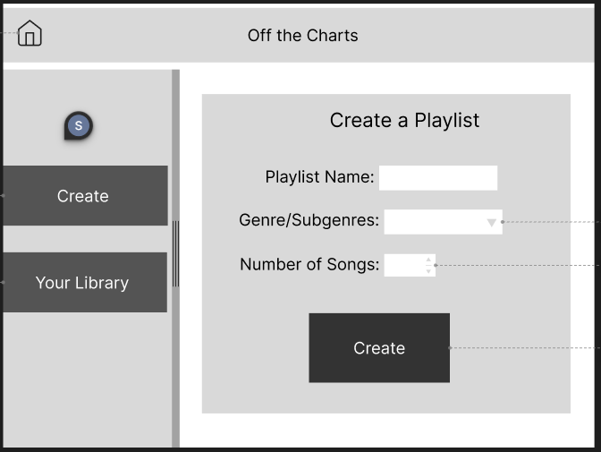
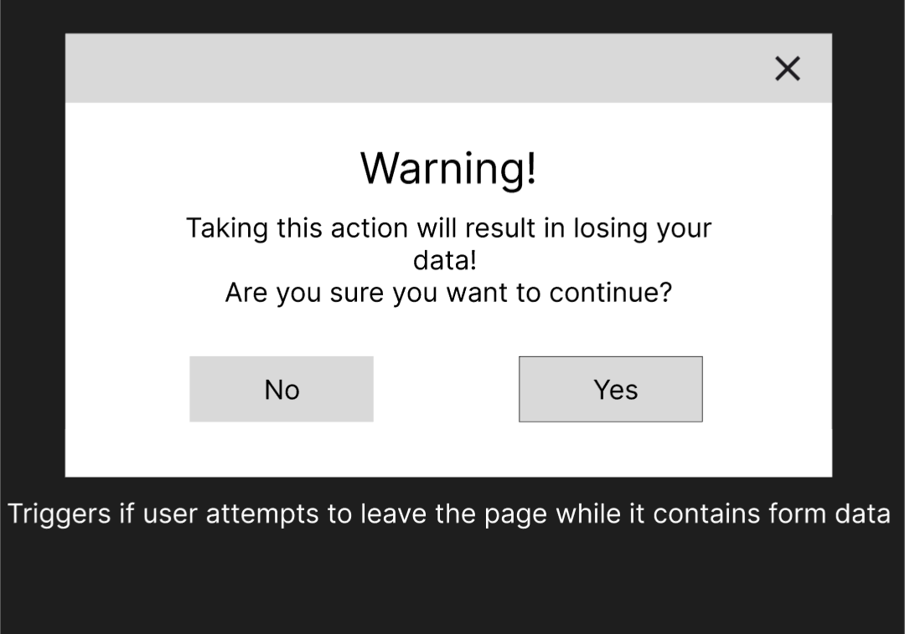
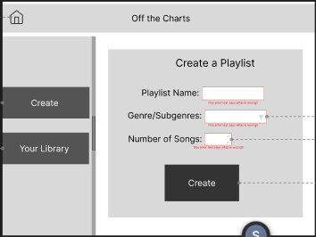
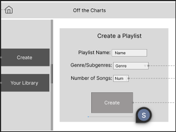

# User Wire Frame - Drafts

## Figma Page
- [Figma Page](https://www.figma.com/design/j14uudALCHGWwTGFcHUhMu/Mallia---Revised?node-id=0-1&t=YoKyL2F8KKGnrfzI-1)

## User Flow

## Create Form

## Confirmation Box

## Create Page w/Errors

## Create Page w/Progress Bar

## Revisions
- Heuristic 8: Aesthetic and Minimalist Design
    - This heuristic says that you should provide the user with only that information which is relevant. Since menu is not always needed information, I made it collapsible into the side pane.
- Heuristic 9: Help Users Recognize, Diagnose, and Recover from Errors
    - This heuristic tells us that the user shouldn't be confused by errors and should know what caused them and how to fix them. For this reason I added red boxes and red error text to indicate what field is causing the error and why.
- Heuristic 1: Visibility of System Status
    - ince generating the playlist may occasionally take some time, especially for longer playlists and as the generation procedure grows more sophisticated, the user may be left wondering why their page isn't loading. For this reason, I made the fields and button gray out and added a progress bar to display when the user clicks create.