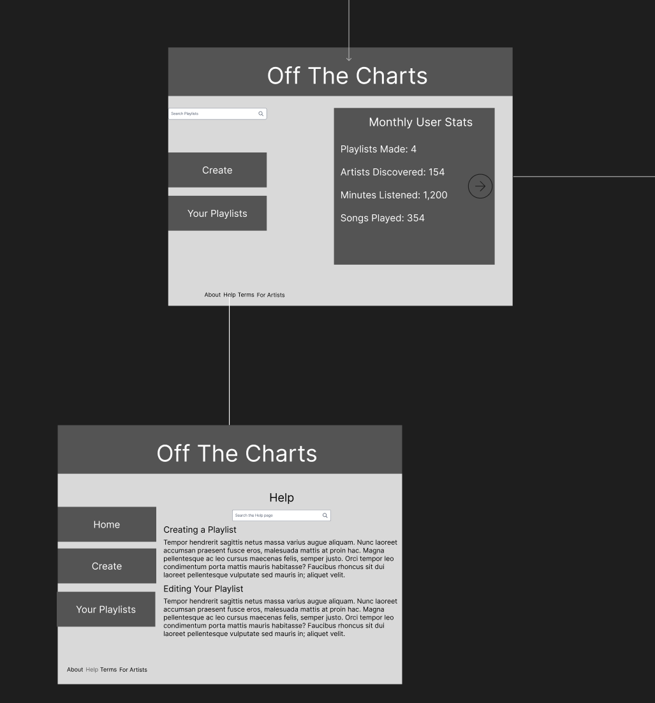
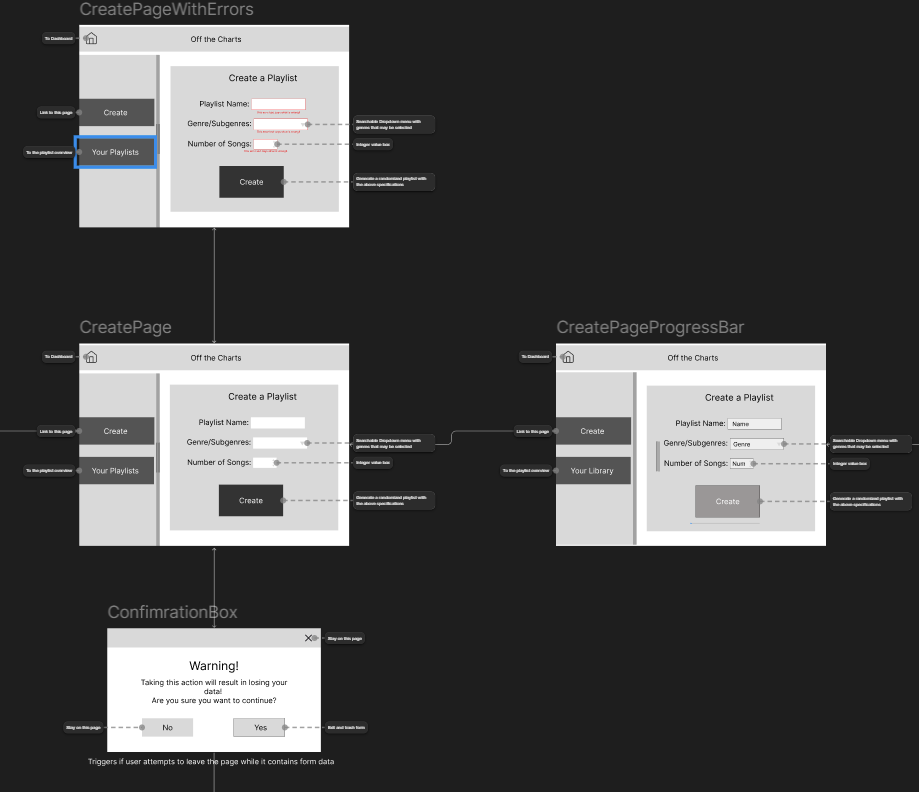
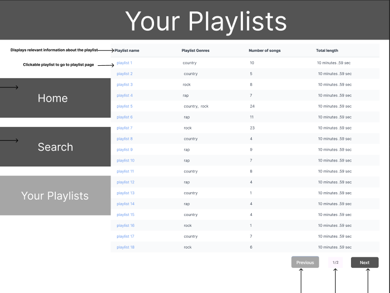
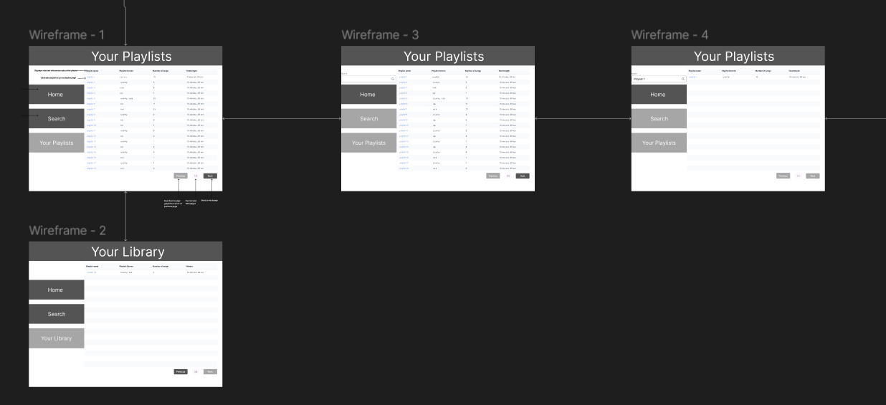
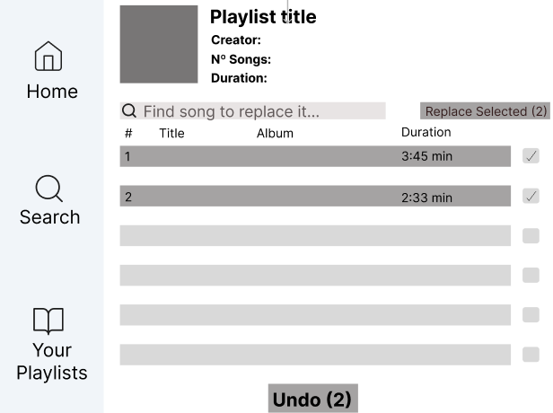
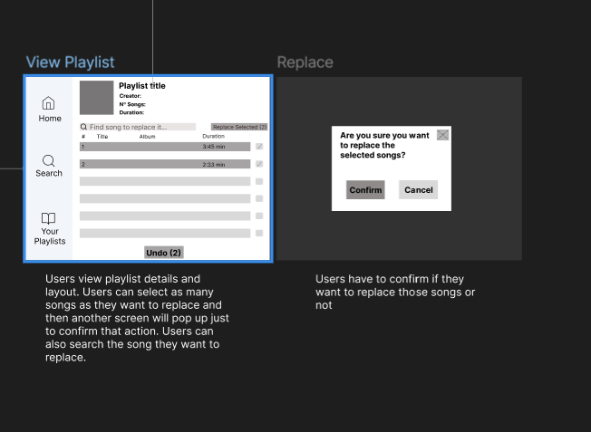
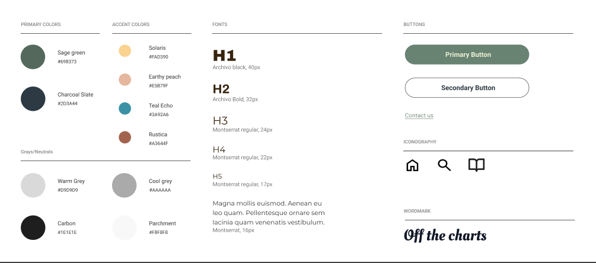

# UI/UX Design
## Userflow

## Wireframes
### Overview

### Homepage

The top wireframe is the opening page that the user will see when they enter the app.  From there the user can access a help page that will give them information on how our app works
### Create

Our create page is where the user will input the information on what kind of playlist that the user wants.  This will give warnings whenever information isn't inputted or if they try to leave before the page is created.
### Your Playlists

This page shows the playlists that have already been created. From here they can see the information on each playlist.  Here they can click a search button to search the name of a playlist.  As well the can navigate the playlist by clicking next and previous to go to more pages.
### View Playlist

From this screen the user can see information on one playlist.  Here they can modify and rerandomize what songs exists within the playlist. They will then give a confirmation on those choices.

## Brand Guide
